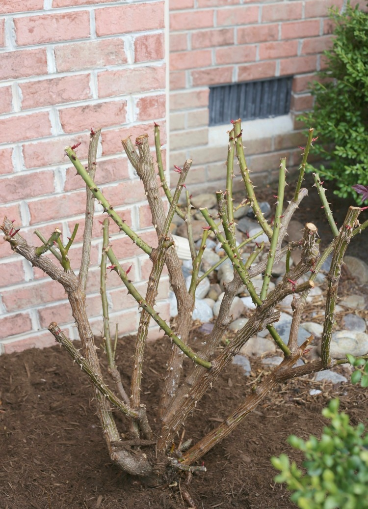

+++
date = '2025-01-27T17:36:22-05:00'
draft = false
title = 'Prune Your Time Like You Prune a Rose'
summary = 'summary'
+++

Once again – I have found myself doing too many things and I’ve been stretching out myself too thin. I have always been a yes man type of guy – to do this and do that – but there just isn’t enough time to do them all unfortunately 🙁 Even the things I get to spend time doing ends up being half-assed. Sometimes you gotta say “no” and prune things out so that what you actually work on becomes even more vibrant.

Incoming rose bush facts. You probably seen a rose bush like the one pictured above. Looks pretty ugly right? This is a result of pruning. But why do them like that? Well – pruning a rose bush is to remove all the dead, unproductive and diseased branches. If it’s NOT pruned this results in smaller blooms because the nutrients will be distributed among all the healthy and unhealthy branches. However, if a rose bush is pruned, all the nutrients will be sent to just the healthy branches – and as you guessed it – results in a more beautiful bloom.

So “Prune your time like you prune a rose bush”.

One should intentionally cut away unnecessary commitments, tasks, or distractions from your schedule, just like you would remove dead or overgrown branches from a rose bush to promote healthy new growth. Focus on the most important activities and making your time more efficient and productive.

The key is not to prioritize what’s on your schedule, but to schedule your priorities. ~Steven Covey
