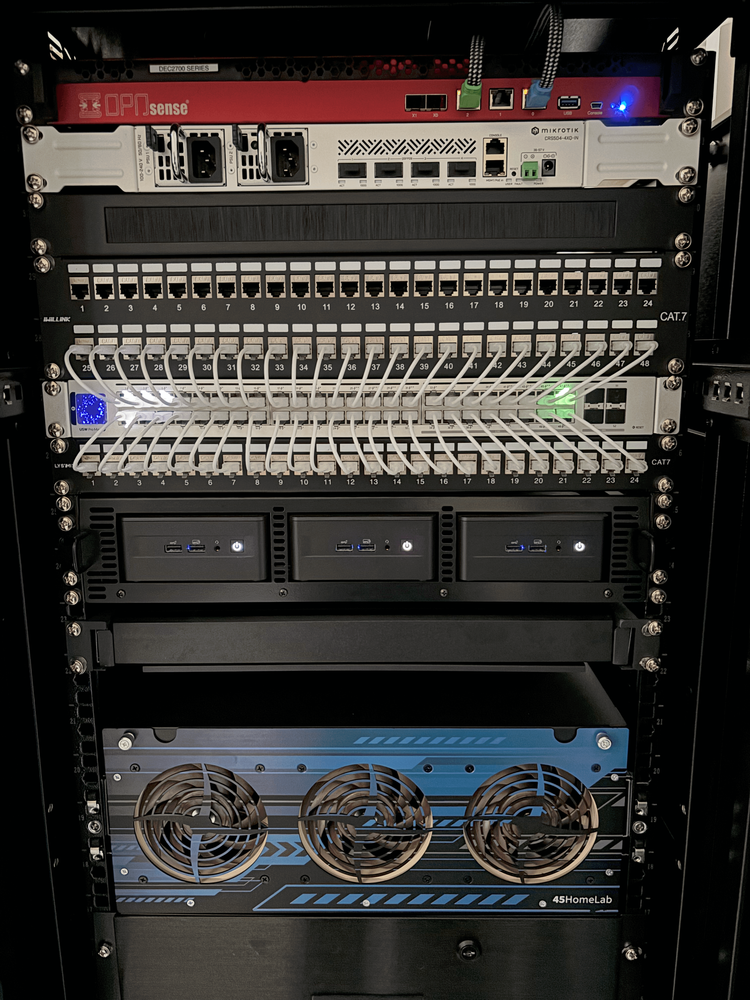

+++
date = '2024-08-26T17:36:22-05:00'
draft = false
title = 'Homelab #1 - Humble Beginnings'
+++

Homelab Series:

- [Homelab #1 - Humble Beginnings](/tinkering/2024-08-26/)
- [Homelab #2 - Proxmox Cluster](/tinkering/2025-06-04/)
- [Homelab #3 - Kubernetes Cluster](/tinkering/2025-06-05/)
- [Homelab #4 - VM/Container Bonanza](/tinkering/2025-06-06/)

# Humble Beginnings

Below is a picture of my homelab setup.

Yeaaaaaa it's alot. But it used to have its humble beginnings as a Raspberry Pi cluster lol

Don't ask me why I've upgraded this Pi cluster into a behemoth. I just want to learn and tinker okayy. It's makes me happy :)

# Researching Components

Now researching which parts to get was a PITA bread. Usually, a homelab at this scale requires some general components, such as:
- Router
- Switch(s)
- and a bunch of computers
- and a bunch of storage
- an Uninterruptible Power Supply (*i didn't get one bc I read that it could catch on fire*)

One should also think about software not just hardware, as that would dictate which hardware to buy.
For example, Router firmware could be: proprietary or open-source.
If you choose proprietary such as Ubiquiti then you'll be forced to buy their hardware.
I don't think they allow their software to be installed into any computer - i think.
Correct me if I'm wrong. 
Anyway, I was left choosing between Ubiquiti or OPNSense.
I've opted for OPNSense.
It's open-source.
Ubiquiti has nice UI, but I've read somewhere that it needs internet connection for setup which I don't like.

# BUYING TIME

Skipping my decision-making process, here's what I've ended up with: 
- [Sysrack's 32U Enclosed Server Rack](https://sysracks.com/product/32u-39-depth-it-telecom-cabinet-srf-32-6-10/)
- [DEC2752 – OPNsense Rack Security Appliance](https://shop.opnsense.com/product/dec2752-opnsense-rack-security-appliance/)
- [MikroTik CRS504-4XQ-IN](https://www.amazon.com/dp/B0B34Y1D6P?psc=1&ref=ppx_yo2ov_dt_b_product_details)
- [1U Brush Panel](https://www.aliexpress.us/item/3256806570018242.html?spm=a2g0o.order_list.order_list_main.5.14761802EqYtl0&gatewayAdapt=glo2usa)
- [Pro Max 48 PoE Switch](https://store.ui.com/us/en/pro/collections/unifi-switching-pro-max/products/usw-pro-max-48-poe?variant=USW-Pro-Max-48-PoE)
- [48x Port RJ45 Patch Panel Cat7 iwillink 10Gbps](https://www.amazon.com/dp/B0BXKFNMJG?ref=ppx_yo2ov_dt_b_product_details&th=1)
- [24x Port RJ45 Patch Panel Cat7](https://www.amazon.com/gp/product/B0CKP2XFKG/ref=ppx_yo_dt_b_asin_title_o00_s00?ie=UTF8&psc=1)
- [48x UniFi Etherlighting Patch Cables](https://store.ui.com/us/en/collections/unifi-accessory-tech-cable-patch/products/uacc-cable-patch-el?variant=uacc-cable-patch-el-015m-w-24)
- [16 Port Rack Mount Monitor KVM Switch](https://www.amazon.com/dp/B0B68BMNFV?ref=ppx_yo2ov_dt_b_product_details&th=1)
- [NUC Rackmount Adaptor](https://www.mk1manufacturing.com/Intel-NUC-Mini-PC/NUC-Rackmount-Adaptor-p75.html)
  - [3x Intel NUC 12 NUC12WSHi7](https://www.amazon.com/dp/B0BJDXCRCP?ref=ppx_yo2ov_dt_b_product_details&th=1)
  - [3x G.SKILL Ripjaws DDR4 SO-DIMM RAM 64GB (2x32GB)](https://www.amazon.com/dp/B08H2HC87Z?psc=1&ref=ppx_yo2ov_dt_b_product_details) 
  - [3x Samsung 870 EVO SATA III SSD 1TB](https://www.amazon.com/dp/B08QBJ2YMG?ref=ppx_yo2ov_dt_b_product_details&th=1) 
  - [3x SAMSUNG 980 PRO SSD 1TB](https://www.amazon.com/dp/B08GLX7TNT?ref=ppx_yo2ov_dt_b_product_details&th=1)
- [45HomeLab's HL15](https://store.45homelab.com/configure/hl15)
  - [4x IronWolf Pro 18TB-ST18000NT001](https://www.seagate.com/products/nas-drives/ironwolf-pro-hard-drive/?sku=ST4000NT001)
- [2x AC Infinity Rack Mount Drawer 4U](https://www.amazon.com/dp/B0775ZLJLQ?ref=ppx_yo2ov_dt_b_product_details&th=1)

Added to cart and checked out a dozen times.

Now it's time to wait for all of them to be shipped and delivered :/

# Arrival Time!

After waiting 3+ weeks - they've finally all arrived! I've enlisted some folks to help me setup the rack itself since I'm weak.
Then slowly over time it's coming all together as I've imagined it :D



# Broken Router >:(

After putting everything together - I've booted the router.

It's not working!!!!

I thought I was just being dumb and didn't know how to use the USB console connection.
So I've continued tinkering/debugging it for a week lol just to find myself sending it back.
Sigh - this shipment was from Europe: so it's guna take a week to get there, x amount of days for them to fix it, and another week for them to send it back...
The good thing is that they covered the cost of shipping (as they should i guess).

Found out that the motherboard was defective - wat - so they replaced it and sent it back.

Now it's working but one of the ethernet ports is broken... Didn't bother sending it back since I could reconfigure it to use another port. It's just that I have one less port to play with.

Quality control at that place is terrible - won't be buying from them again.

# Ending

Now it's all up and running!

Next up is to install and configure some servers on this behemoth.

