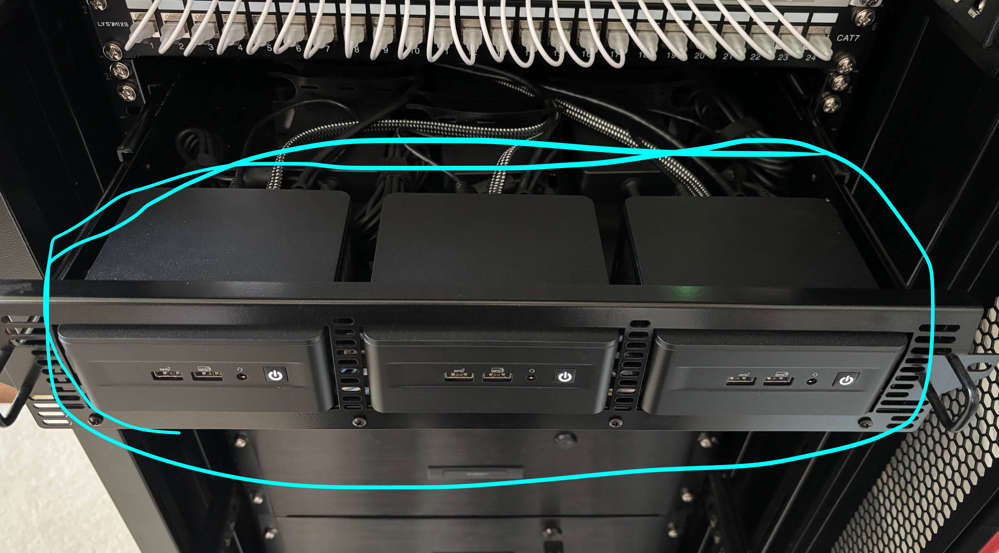

+++
date = '2025-06-04T17:36:22-05:00'
draft = false
title = 'Homelab #2 - Proxmox Cluster'
+++

Homelab Series:

- [Homelab #1 - Humble Beginnings](/tinkering/2024-08-26/)
- [Homelab #2 - Proxmox Cluster](/tinkering/2025-06-04/)
- [Homelab #3 - Kubernetes Cluster (Initial Setup)](/tinkering/2025-06-05/)
- [Homelab #4 - Kubernetes Cluster (Infrastructure Setup)](/tinkering/2025-06-06/)
- [Homelab #5 - Kubernetes Cluster (App Setup)](/tinkering/2025-06-08/)

# Proxmox Cluster

In this post I will go over setting up a Proxmox Cluster on my 3 Intel NUCs in my [homelab rack](/tinkering/2024-08-26/).

This will allow my servers to run in [high availability](https://en.wikipedia.org/wiki/High_availability) just in case one NUC goes down.

# Download Proxmox ISO and Create USB Boot Device

Download and install: https://www.proxmox.com/en/downloads/proxmox-virtual-environment

I've downloaded the ISO file and used [BalenaEtcher](https://etcher.balena.io/) to create the USB boot medium.

# Configure Proxmox Cluster

Once Proxmox was installed on each of the three machines, I've just followed this to setup the cluster:


