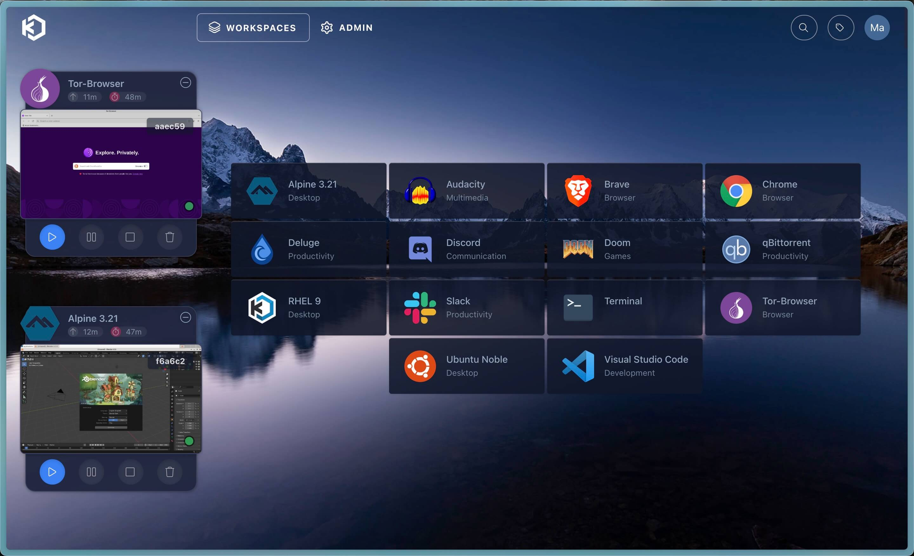
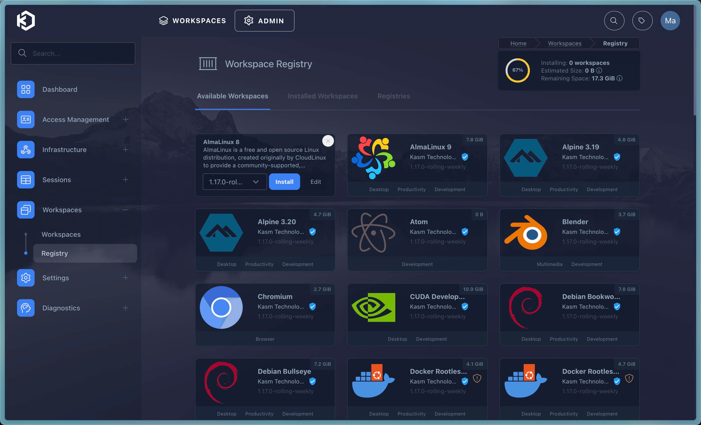
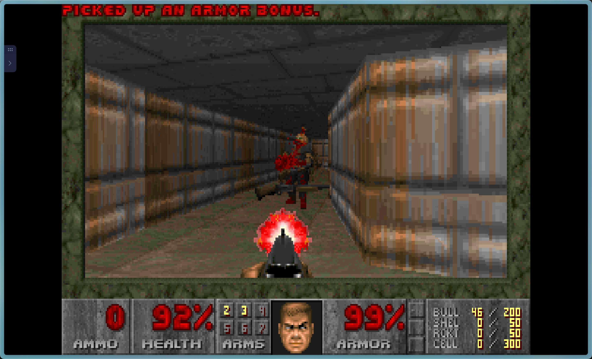

+++
date = '2025-06-11T00:00:00-05:00'
draft = false
title = 'Homelab #7 - Kasm'
+++

**What is Kasm?**

To me, Kasm is essentially a remote desktop that runs right in your browser.

Beyond full desktops, Kasm also lets you launch individual applications - like Discord, Doom, VS Code, and more—directly in the browser.

Here’s a look at my Kasm setup:

[](assets/1.jpeg)

# Installation

Execute the following commands

```shell
cd /tmp
curl -O https://kasm-static-content.s3.amazonaws.com/kasm_release_1.17.0.7f020d.tar.gz
tar -xf kasm_release_1.17.0.7f020d.tar.gz
sudo bash kasm_release/install.sh
```

# Setup

Once installed - register your account. After that we can download you choice workspaces under `ADMIN` > `Workspaces` > `Registry`

[](assets/2.jpeg)

Once downloaded you can open a session of a workspace under `WORKSPACES`.

And your done!

Here's Doom running within my browser through Kasm!

[](assets/3.jpeg)

# Thoughts

I won’t be using Kasm, as my Proxmox setup already covers this functionality.
While Kasm has a sleek UI, it seems more suited for enterprise use cases - like companies that need remote desktop solutions, similar to Citrix.

