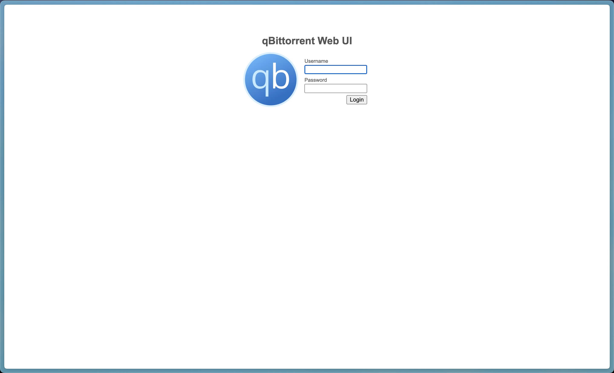

+++
date = '2025-06-13T00:00:00-05:00'
draft = false
title = 'How to Install qBittorrent on Ubuntu Server 24.04'
+++

For some reason there is an issue with running qBittorrent as a SystemD service on Ubuntu Server 24.04. 

Here is how I've done it.

# Install qbittorrent-nox

```shell
sudo apt install qbittorrent-nox
```

# Initial Run and Password Setup

make note of username (this will be used in Systemd Setup):

```shell
whoami
```

Run qbittorrent as user:

```shell
qbittorrent-nox
```

Make note of the username and password in console output as shown below:

```console
*** Legal Notice ***
qBittorrent is a file sharing program. When you run a torrent, its data will be made available to others by means of upload. Any content you share is your sole responsibility.

No further notices will be issued.

Press 'y' key to accept and continue...
y
WebUI will be started shortly after internal preparations. Please wait...

******** Information ********
To control qBittorrent, access the WebUI at: http://localhost:8080

The WebUI administrator username is: admin
The WebUI administrator password was not set. A temporary password is provided for this session: mL7St5JE9
You should set your own password in program preferences.
```

Open [http://localhost:8080/](http://localhost:8080/) in browser, and login.

[](assets/2.jpeg)

Click on `blue gearbox` > `Web UI`. Under `Authentication` change username and password. Scroll to bottom and click `save`.

[](assets/1.jpeg)

# Setup Systemd Service

Create a new service file

```shell
sudo vim /etc/systemd/system/qbittorrent-nox.service
```

add the following contents into service file

```ini
[Unit]
Description=qBittorrent Command Line Client
After=network.target
 
[Service]
Type=forking
User=USERNAME_HERE  <---------------------- replace with username fromwhoami
Group=USERNAME_HERE <---------------------- replace with username fromwhoami
UMask=007
ExecStart=/usr/bin/qbittorrent-nox -d --webui-port=8080
Restart=on-failure
 
[Install]
WantedBy=multi-user.target
```

Execute the following commands

```shell
sudo systemctl daemon-reload
sudo systemctl enable qbittorrent-nox
sudo systemctl start qbittorrent-nox
sudo systemctl status qbittorrent-nox
```

Go back to [http://localhost:8080/](http://localhost:8080/). You should be able to login with your new username password.