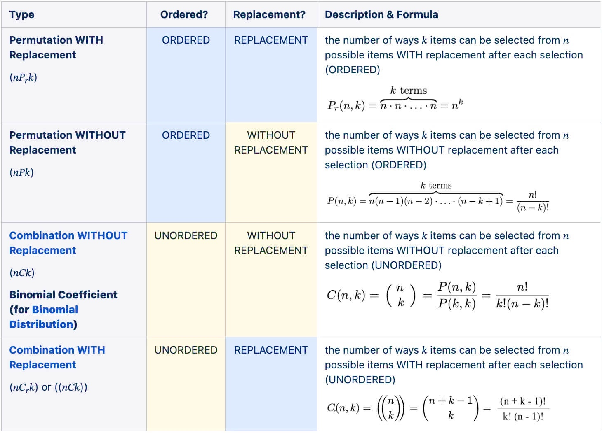
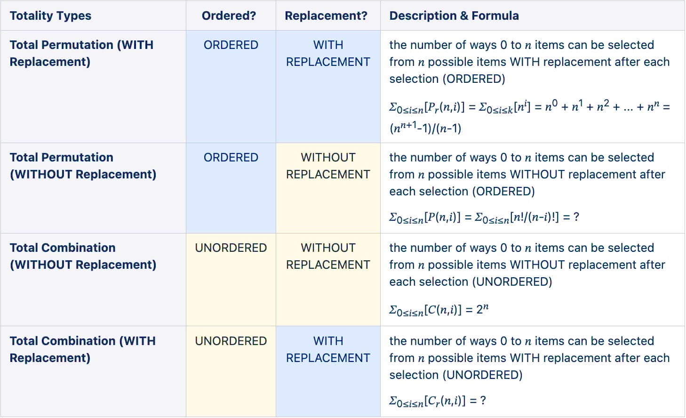

+++
date = '2025-06-14T00:00:00-05:00'
draft = false
title = 'Permutation vs Combination'
+++

- **permutation** - refers to the different ways of arranging items from a set of objects, in a sequential order 
- **combination** - refers to the different ways of choosing items from a set of objects, such that their order does not matter

# Totality

