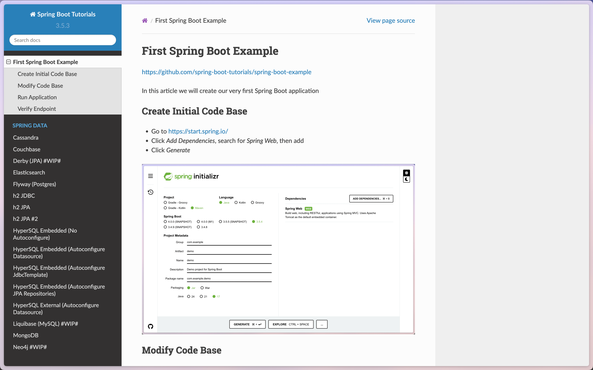

+++
date = '2025-07-30T00:00:00-05:00'
draft = false
title = 'Spring Boot 3.5 Guides'
+++

# Problem

I wanted to go over the entire Spring Boot material for version 3.

I've done this before for Spring Boot version 2, but I haven't done it for version 3.
So I've gone back to the site [www.baeldung.com](https://www.baeldung.com) but noticed some articles are out of date?
Also, some had clear mistakes that took me a good minute to figure out...
And their code is behind a paywall, and their site is filled with noisy ads.

# Solution

So to spare the trouble for anybody.

I've created 77 proof-of-concepts of varying Spring Boot features and made them public on Github.
I've also wrote bare-bones documentation for each feature and made them available 
at:

- [spring-guides.marcuschiu.com](https://spring-guides.marcuschiu.com).

They will never be behind a paywall - nor will ads ever be shown.

