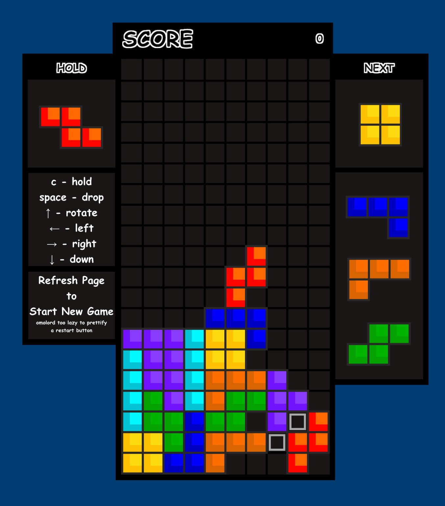

+++
date = '2025-08-07T00:00:00-05:00'
draft = false
title = 'Learning ReactJS'
+++

# Problem

I wanted to learn a new UI framework. In the past, I've gone through **Angular**.
Now it's time to devour **ReactJS**. Maybe the next logical step is to learn 
**React Ionic** and/or **React Native**?

# Solution

I've spent the past 2 working days going through the ReactJS tutorials 
[here](https://react.dev/learn/your-first-component).

Next, I've decided to build a Tetris game using ReactJS.
Though I've ended up using a bunch more plain JavaScript lol.

- [tetris.marcuschiu.com](https://tetris.marcuschiu.com)

[](https://spring-guides.marcuschiu.com)

# How I Built it

First, I needed a step counter to move the active
piece down automatically. This is straightforward with JavaScript's 
builtin setInterval function. However, this may collide with user input 
when the down key is pressed once. There can be a times when a
single down key is pressed and the auto setInterval down activates
at the same time which renders two downs at the same time. This is 
not ideal. Thus, modifying the code, so that whenever, down key 
is pressed, the auto setInterval is destroyed and then re-initialized
whenever the down key is lifted. This allows the auto setInterval
to be restarted.

```js
function stepCounter() {
    // auto move active pieve down
}

let intervalId_gameEngineStepCounter = 0;
function gameEngineStepCounter_Start(stepCounter) {
    if (intervalId_gameEngineStepCounter === 0) {
        intervalId_gameEngineStepCounter = setInterval(stepCounter, 1000);
    }
}
function gameEngineStepCounter_Stop() {
    if (intervalId_gameEngineStepCounter !== 0) {
        clearInterval(intervalId_gameEngineStepCounter);
        intervalId_gameEngineStepCounter = 0;
    }
}
```

```js
function keydownEC(event) {
    if (event.key === "ArrowDown") {
        gameEngineStepCounter_Stop();
        // do manual down move
    }
}

function keyupEC(event) {
    if (event.key === "ArrowDown") {
        gameEngineStepCounter_Start(stepCounter);
    }
}
```

Next, I needed to figure out how to visually display the grid. I've
opted for canvas as it was easier to manipulate. Since each grid square
is 40px by 40px, so the canvas size will be 400px by 800px. I've added 
an additional 4px on each side for padding/borders.

```html
<canvas className="canvas" width="404" height="804" ref={canvasRef} />
```

Next, I needed to figure out how to manage the game state. I've opted
for a 2D array of numbers all initialized to 0. This will denote empty

```js
gridState = Array.from({ length: 20 }, () => new Array(10).fill(0));
```

Originally it was

```js
gridState = Array.from({ length: 10 }, () => new Array(20).fill(0));
```

But this was harder to manipulate the clearing of lines function.

Next, I needed to figure out how to manage the pieces. I've opted for a 
2D array for each tetris piece. And the number will denote the color for
the rendering function.

```js
const pieceMap = [
    [[0,0,0,0],
     [0,1,1,0],
     [0,1,1,0],
     [0,0,0,0]],
    [[0,2,0,0],
     [0,2,0,0],
     [0,2,0,0],
     [0,2,0,0]],
    [[0,3,0],
     [0,3,3],
     [0,3,0]],
    [[0,4,0],
     [0,4,4],
     [0,0,4]],
    [[0,0,5],
     [0,5,5],
     [0,5,0]],
    [[0,0,0,0,0],
     [0,0,0,0,0],
     [0,0,6,6,0],
     [0,0,6,0,0],
     [0,0,6,0,0]],
    [[0,0,7,0,0],
     [0,0,7,0,0],
     [0,0,7,7,0],
     [0,0,0,0,0],
     [0,0,0,0,0]],
];
```

Next, I needed to figure out the move logic for the active piece: left, right, rotate, and hard drop.
How do you encode collision detection? Well, it can be easily done by simulating a move
ahead of time and if there are any overlaps, collisions, or out of bounds. 

Simulating move right

```js
isCollision(gridState, curPieceX + 1, curPieceY, curPieceMap)
```

Simulating move left

```js
isCollision(gridState, curPieceX - 1, curPieceY, curPieceMap)
```

Simulating move down

```js
isCollision(gridState, curPieceX, curPieceY + 1, curPieceMap)
```

Collision logic

```js
function isCollision(gridState, curPieceX, curPieceY, curPieceMap) {
    let xSize = curPieceMap.length;
    let ySize = curPieceMap[0].length;

    for (let i = 0; i < xSize; i++) {
        for (let j = 0; j < ySize; j++) {

            let x = curPieceX + i;
            let y = curPieceY + j;

            if (curPieceMap[i][j] !== 0) {
                if (y > 19 || x < 0 || x > 9) { // check for out of bounds
                    return true;
                } else {
                    if (y < 0) { // if above the grid that's fine
                        // do nothing
                    } else if (gridState[y][x] !== 0) {
                        return true;
                    }
                }
            }
        }
    }
    return false;
}
```

Next, is making it pretty. I've googled some images of tetris blocks 
that would be simple for canvas rendering.

```js
function renderBlock(ctx, x, y, gridStateValue, x_shift = 0, y_shift = 0) {
    let fillColor = 'blue';
    let fillColorShade = 'blue';

    // Fill Color
    ctx.fillStyle = fillColor;
    ctx.fillRect((x * 40) + 2 + x_shift, (y * 40) + 2 + y_shift, 40, 40); // x, y, width, height
    ctx.fill();

    // Fill Color Shade
    ctx.fillStyle = fillColorShade;
    ctx.fillRect((x * 40) + 2 + x_shift, (y * 40) + 2 + y_shift, 15, 40); // x, y, width, height
    ctx.fill();
    ctx.fillStyle = fillColorShade;
    ctx.fillRect((x * 40) + 2 + x_shift, (y * 40) + 2 + 25 + y_shift, 40, 15); // x, y, width, height
    ctx.fill();

    // Outline
    ctx.strokeStyle = 'rgb(41,39,39)'; // Set the stroke color
    ctx.lineWidth = 4; // Set the line width
    ctx.strokeRect((x * 40) + 2 + x_shift, (y * 40) + 2 + y_shift, 40, 40); // Draw an outlined red rectangle
}
```

Next, we need to color map based on the piece value

```js
switch (gridStateValue) {
    case 1:
        // Code to execute if expression === value1
        fillColor = 'rgb(251,219,15)';
        fillColorShade = 'rgb(255,193,0)';
        break;
    case 2:
        fillColor = 'rgb(0,247,255)';
        fillColorShade = 'rgb(2,195,212)';
        break;
    case 3:
        fillColor = 'rgb(137,59,253)';
        fillColorShade = 'rgb(114,18,254)';
        break;
    case 4:
        fillColor = 'rgb(254,103,2)';
        fillColorShade = 'rgb(254,5,0)';
        break;
    case 5:
        fillColor = 'rgb(0,180,0)';
        fillColorShade = 'rgb(0,164,1)';
        break;
    case 6:
        fillColor = 'rgb(252,110,1)';
        fillColorShade = 'rgb(216,100,0)';
        break;
    case 7:
        fillColor = 'rgb(1,0,252)';
        fillColorShade = 'rgb(1,0,194)';
        break;
    default:
        // Code to execute if no case matches
}
```

And that's pretty much it... the rest is just fleshing out the game logic.
