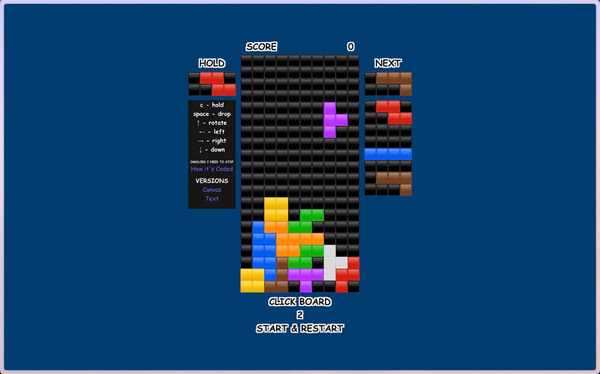

+++
date = '2025-08-11T00:00:00-05:00'
draft = false
title = 'Rebuilt Tetris Using Unicode'
+++

# Problem

A couple of days ago [I built Tetris](/tinkering/2025-08-07/) using canvas as the base visual.
Something tickled my ADHD and thought if I could do it in Unicode text.

# Solution

I've googled Unicode tetris emojis but found nothing.
Then I've stumbled upon these Unicode characters/symbols?

- ⬛🟫🟧🟪🟥🟦🟨🟩

That's exactly what I needed!

Because I'm a genius - the original code had the game logic and render logic separate.
Thus, all I need to do is to rewrite the render logic using ⬛🟫🟧🟪🟥🟦🟨🟩.

The base board will be a `<div>` of `<div>`s like so:

```xml
<div className="text-board board">
    <div>⬛⬛⬛⬛⬛⬛⬛⬛⬛⬛</div>
    <div>⬛⬛⬛⬛⬛⬛⬛⬛⬛⬛</div>
    <div>⬛⬛⬛⬛⬛⬛⬛⬛⬛⬛</div>
    <div>⬛⬛⬛⬛⬛⬛⬛⬛⬛⬛</div>
    <div>⬛⬛⬛⬛⬛⬛⬛⬛⬛⬛</div>
    <div>⬛⬛⬛⬛⬛⬛⬛⬛⬛⬛</div>
    <div>⬛⬛⬛⬛⬛⬛⬛⬛⬛⬛</div>
    <div>⬛⬛⬛⬛⬛⬛⬛⬛⬛⬛</div>
    <div>⬛⬛⬛⬛⬛⬛⬛⬛⬛⬛</div>
    <div>⬛⬛⬛⬛⬛⬛⬛⬛⬛⬛</div>
    <div>⬛⬛⬛⬛⬛⬛⬛⬛⬛⬛</div>
    <div>⬛⬛⬛⬛⬛⬛⬛⬛⬛⬛</div>
    <div>⬛⬛⬛⬛⬛⬛⬛⬛⬛⬛</div>
    <div>⬛⬛⬛⬛⬛⬛⬛⬛⬛⬛</div>
    <div>⬛⬛⬛⬛⬛⬛⬛⬛⬛⬛</div>
    <div>⬛⬛⬛⬛⬛⬛⬛⬛⬛⬛</div>
    <div>⬛⬛⬛⬛⬛⬛⬛⬛⬛⬛</div>
    <div>⬛⬛⬛⬛⬛⬛⬛⬛⬛⬛</div>
    <div>⬛⬛⬛⬛⬛⬛⬛⬛⬛⬛</div>
    <div>⬛⬛⬛⬛⬛⬛⬛⬛⬛⬛</div>
</div>
```

Next, whenever we need to render gridState we will create an empty board of ⬛.

```js
const newBoard = [];
for (let i = 0; i < 20; i++) {
    newBoard.push(["⬛","⬛","⬛","⬛","⬛","⬛","⬛","⬛","⬛","⬛"]);
}
```

Given a `gridState` (which is a 2D array of integers) we will update this `newBoard`:

```js
function renderGridState(newBoard, gridState) {
    for (let y = 0; y < 20; y++) {
        for (let x = 0; x < 10; x++) {
            if (gridState[y][x] !== 0) {
                newBoard[y][x] = mapValue(gridState[y][x]);
            }
        }
    }
}
```

Once updated, we will render the DOM:

```js
for (let y = 0; y < 20; y++) {
    divs[y].innerHTML = newBoard[y].join("");
}
```

This pretty much sums up building a text-based Tetris.

Here's what it looks like:

- [tetris-text.marcuschiu.com](https://tetris-text.marcuschiu.com)

[](https://tetris-text.marcuschiu.com)
