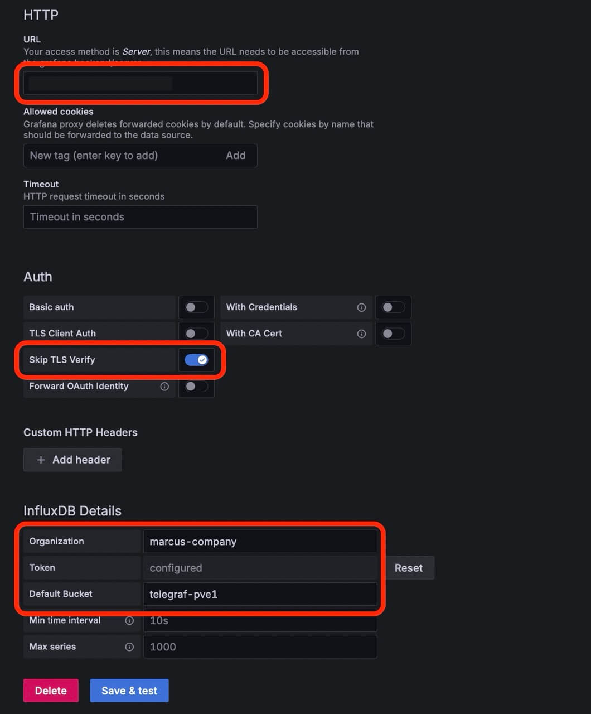
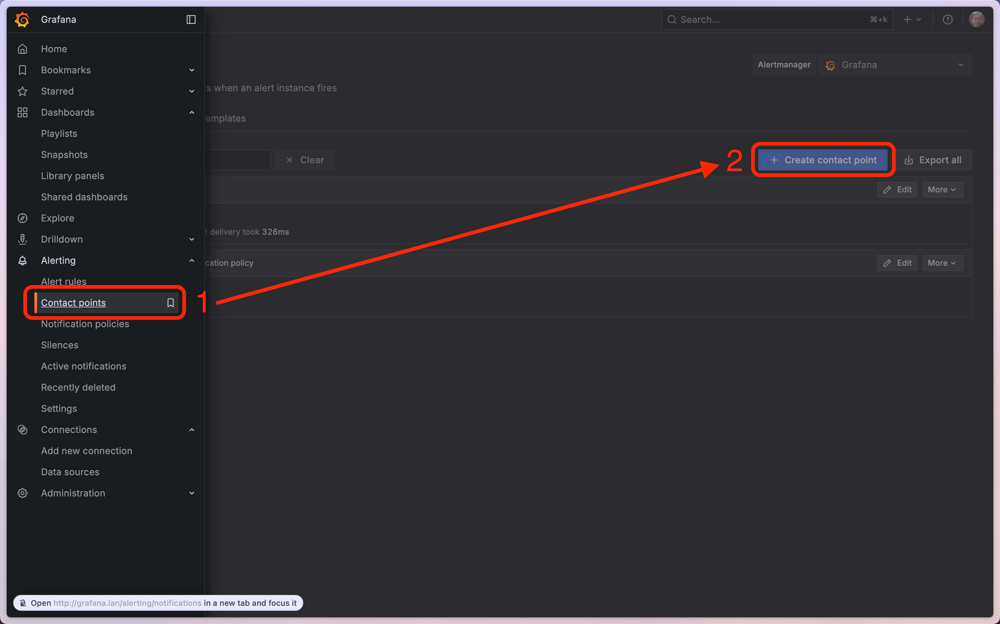

+++
date = '2025-08-13T00:00:00-05:00'
draft = false
title = 'Telegraf + InfluxDB + Grafana'
+++

# Problem

My server keeps shutting down like once every week, and I had no idea why for the past 2 months.
It was overheating... so putting it out into a vented place solved that issue.

But I wanted to be alerted of this problem before it even happens.

# Solution

Setup a (Telegraf + InfluxDB + Grafana) stack.

- InfluxDB - is a time-series database
- Telegraf - is a binary running on the server/computer that will send temp data to InfluxDB
- Grafana - will take data from InfluxDB and display it nicely (and alerts can also be setup here)

# ToC

- [InfluxDB Setup](#influxdb-setup)
- [Telegraf Setup](#telegraf-setup)
- [Grafana Setup](#grafana-setup)

# InfluxDB Setup

Since I have a [Proxmox Cluster](/tinkering/2025-06-04/),
I will be using [Proxmox Helper Scripts](https://community-scripts.github.io/ProxmoxVE/scripts)
to set up an InfluxDB server.

InfluxDB can easily be setup with the following command:

```shell
bash -c "$(curl -fsSL https://raw.githubusercontent.com/community-scripts/ProxmoxVE/main/ct/influxdb.sh)"
```

Once installed, open the InfluxDB webpage via the URL given from the command output.

Next, we will need to create an `organization`, `bucket` and `API token`.

Create an organization & bucket:


Create an API token. Once created copy token value for future use:


# Telegraf Setup

On your server/computer that you want to monitor:

Install lsb-release

```shell
sudo apt-get update
sudo apt-get install lsb-release
```

Install Telegraf

```shell
curl -fsSL https://repos.influxdata.com/influxdata-archive_compat.key | sudo gpg --dearmor -o /etc/apt/trusted.gpg.d/influxdata.gpg
echo "deb https://repos.influxdata.com/ubuntu $(lsb_release -cs) stable" | sudo tee /etc/apt/sources.list.d/influxdata.list
sudo apt update
sudo apt install telegraf
```

Modify the `telegraf.conf` file:

```shell
vim /etc/telegraf/telegraf.conf
```

Find and uncomment the `[[inputs.sensors]]` section for temperature monitoring:

```ini
# Monitor sensors, requires lm-sensors package
[[inputs.sensors]]
## Remove numbers from field names.
## If true, a field name like 'temp1_input' will be changed to 'temp_input'.
# remove_numbers = true

## Timeout is the maximum amount of time that the sensors command can run.
# timeout = "5s"
```

We will also uncomment the `[[inputs.net]]` section for network monitoring.

Next, find and modify the InfluxDB configuration like below:

```ini
[[outputs.influxdb_v2]]
  ## The URLs of the InfluxDB cluster nodes.
  ##
  ## Multiple URLs can be specified for a single cluster, only ONE of the
  ## urls will be written to each interval.
  ##   ex: urls = ["https://us-west-2-1.aws.cloud2.influxdata.com"]
  urls = ["http://influxdb.lan"]

  ## Token for authentication.
  token = "INFLUX_TOKEN_VALUE_HERE"

  ## Organization is the name of the organization you wish to write to; must exist.
  organization = "marcus-company"

  ## Destination bucket to write into.
  bucket = "telegraf-pve1"
```

Save and exit.

In order, for `[[inputs.sensors]]` to work we will need to install `lm-sensors`.

```shell
sudo apt install lm-sensors
```

Start Telegraf server and verify:

```shell
sudo systemctl start telegraf
sudo systemctl enable telegraf
sudo systemctl status telegraf
```

Go back to InfluxDB webpage and verify the bucket is now filled with data


# Grafana Setup

Since I have a [Proxmox Cluster](/tinkering/2025-06-04/),
I will be using [Proxmox Helper Scripts](https://community-scripts.github.io/ProxmoxVE/scripts)
to set up a Grafana server.

Grafana can easily be setup with the following command:

```shell
bash -c "$(curl -fsSL https://raw.githubusercontent.com/community-scripts/ProxmoxVE/main/ct/grafana.sh)"
```

Once installed, open the Grafana webpage via the URL given from the command output.

# Grafana Setup InfluxDB DataSource

Create a connection to InfluxDB




Click save and test.


# Grafana Setup Dashboard (Optional)


Paste in the following [grafana-dashboard.json](assets/grafana-dashboard.json)
into the above input. Then load.

Modify the datasource and bucket variables.


# Grafana Setup Alerts

Let's create a Discord contact point.




Paste in the Discord webhook URL above.
To create one, see [here](https://support.discord.com/hc/en-us/articles/228383668-Intro-to-Webhooks).

Click `Test` and verify a message is displayed in your Discord server.

Then click `save`.

Next, let's create an alert rule.


Enter the following values:


You can click `Preview alert rule condition`.


Then click `save`.

This was probably overkill for being notified of overheating issues. 
But I'll probably use more of InfluxDB and Grafana in the future.
