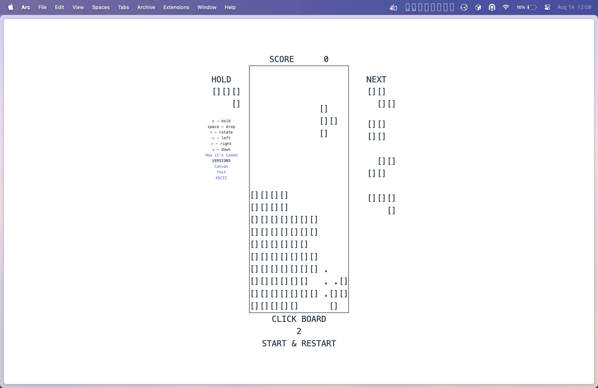

+++
date = '2025-08-14T00:00:00-05:00'
draft = false
title = "I've Built Tetris Using ASCII"
+++

I've made tetris using [`<canvas>`](/tinkering/2025-08-07/) and also [Unicode characters](/tinkering/2025-08-11/) (i.e. 🟧🟪🟥🟦🟨🟩).

So late at night, I've decided to make tetris again using ASCII characters.

[tetris-ascii.marcuschiu.com](https://tetris-ascii.marcuschiu.com)

