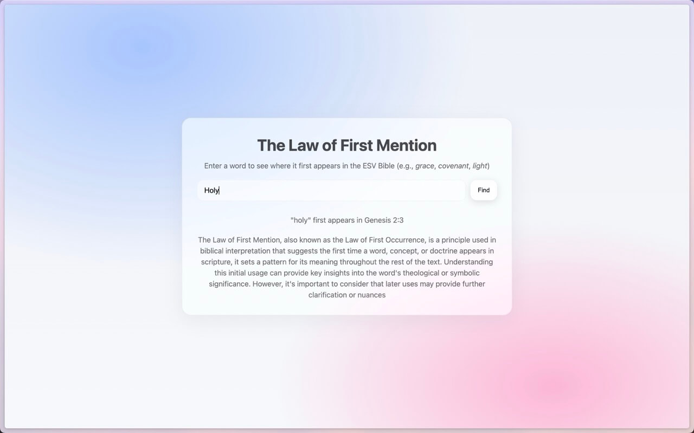

+++
date = '2025-08-15T00:00:00-05:00'
draft = false
title = "The Law of First Mention"
+++

# Problem

I was going through a word study on `holy` in the Bible.
And sometimes knowing the first occurrence of that word helps.

Why not create an app for that?

# Solution

And so I did.

[first-mention.marcuschiu.com](https://first-mention.marcuschiu.com)

[](https://first-mention.marcuschiu.com)

# How it was Built

First, I needed to download the Bible. There are many versions out there, so I'll start with ESV.
But I can't just download any ESV, I needed one that delimits the book, chapter, and verses.

Finding a good source was harder than expected. But I've ended up stumbling upon this
[goldmine of JSON files](https://github.com/jadenzaleski/BibleTranslations).

The JSON format looks something like this:

```json
{
    "Genesis": {
        "1": {
          "1": "In the beginning, God created the heavens and the earth.",
          "2": "The earth was without form and void, and darkness was over the face of the deep. And the Spirit of God was hovering over the face of the waters.",
        },
        "2": {
          "1": "Thus the heavens and the earth were finished, and all the host of them.",
        }
    },
    "Exodus": {
      "1": {
        "1": "These are the names of the sons of Israel who came to Egypt with Jacob, each with his household:",
      }
    }
}
```

Looks perfect!

Next, I needed to write a program to extract the first occurrence of each word and map it to its location.
Something like this:

```txt
holy Genesis 2:3
homage 1 Samuel 24:8
home Gensis 30:25
```

I chose Python to implement this.

Once implemented, needed to build a simple website to query this output.
I've opted to use ChatGPT 5 to help me prettify this website.


Did some minor touch-ups and made it public!

Here's the GitHub link: https://github.com/TheRealMarcusChiu/the-law-of-first-mention
