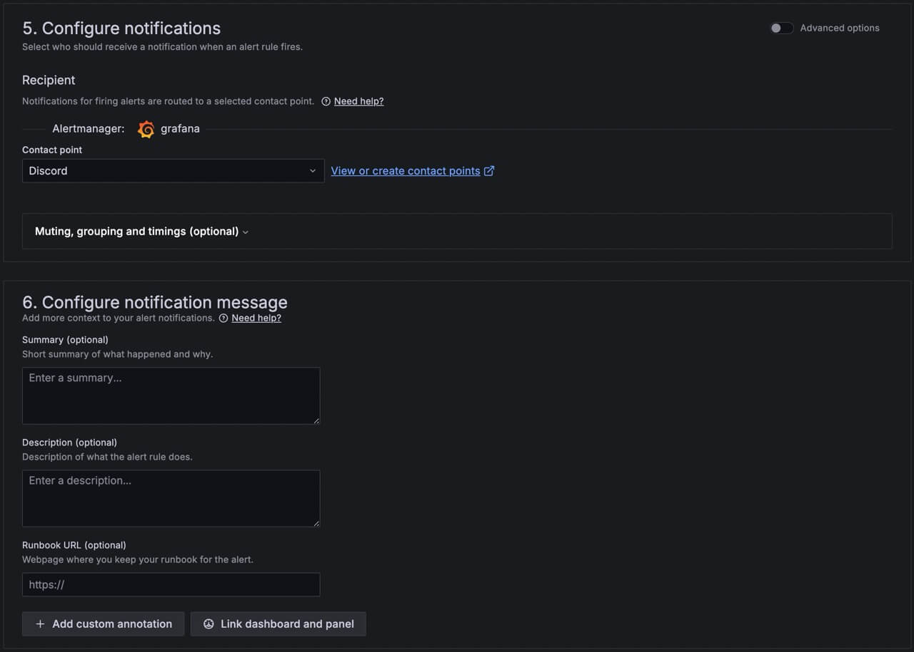

+++
date = '2025-08-16T00:00:00-05:00'
draft = false
title = "Alert Me on Disk Full"
+++

# Problem

I have about 40 linux containers running, 
and I want to be notified when any of the containers used up a majority of its disk space. 

# Solution

I've decided to use the (Telegraf + Influx + Grafana) stack again.
Previously, I've used it for [monitoring server temperatures](/tinkering/2025-08-13/).

So here goes configuring 40 plus linux containers...

Look how beautiful are my alerts :) of course, I've automated to set up.


# ToC

This article assumes you have already set up and are familiar with InfluxDB and Grafana.

Let's consider setting up just one linux container for each of the following steps:

- [1. InfluxDB](#1-influxdb)
- [2. Telegraf](#2-telegraf)
- [3. Grafana](#3-grafana)

You can skip the above manual steps and opt an automated route:

- [Automate for 40 Linux Containers](#automate-for-40-linux-containers)

# 1. InfluxDB

In the InfluxDB web console, create:

- a new `Bucket` - see [here](/tinkering/2025-08-13/#create-a-bucket)
- an `All Access API token` - see [here](/tinkering/2025-08-13/#create-an-api-token)

# 2. Telegraf

Download the Telegraf binary from their GitHub [release page](https://github.com/influxdata/telegraf/releases).

The `telegraf.conf` is simple because we will be just monitoring the root disk (make sure to replace those values below!):

```ini
[global_tags]
[agent]
  interval = "10s"
  round_interval = true
  metric_batch_size = 1000
  metric_buffer_limit = 10000
  collection_jitter = "0s"
  flush_interval = "10s"
  flush_jitter = "0s"
  precision = "0s"
[[inputs.disk]]
  mount_points = ["/"]

[[outputs.influxdb_v2]]
  urls = ["$INFLUXDB_URL_HERE"]
  organization = "$INFLUXDB_ORG_NAME_HERE"
  bucket = "$INFLUXDB_BUCKET_NAME_HERE"
  token = "$INFLUXDB_API_TOKEN_HERE"
```

Run telegraf with this configuration:

```shell
telegraf -config telegraf.conf
```

Verify in InfluxDB Web UI that metrics are being received.

# 3. Grafana

Here we will be creating an alert for a single linux container.

Let's create a new rule:




# Automate for 40 Linux Containers

Now doing the same 3 steps above for 40 times is too much. I'm lazy.
So I've written a script to automate all of this.

Here it is in Github: https://github.com/TheRealMarcusChiu/proxmox-scripts

### Auto Telegraf & InfluxDB

To install Telegraf on all your Linux containers,
and auto create buckets on InfluxDB,
create a file `proxmox-server-setup-lxcs.sh` in your proxmox server:

```shell
#!/bin/bash

INFLUXDB_URL="REPLACE_ME"
INFLUXDB_API_TOKEN="REPLACE_ME"
INFLUXDB_ORG_ID="REPLACE_ME"
INFLUXDB_ORG_NAME="REPLACE_ME"
INFLUXDB_BUCKET_NAME_PREFIX="telegraf-lxc-"

pct list | grep running | while read line; do
    ID=$(echo "$line" | awk '{print $1}')
    NAME=$(echo "$line" | awk '{print $3}')

    INFLUXDB_BUCKET_NAME="$INFLUXDB_BUCKET_NAME_PREFIX$NAME"

    # Create telegraf bucket
    curl -X POST "$INFLUXDB_URL/api/v2/buckets" \
         -H "Authorization: Token $INFLUXDB_API_TOKEN" \
         -H "Content-type: application/json" \
         -d "{
               \"name\": \"$INFLUXDB_BUCKET_NAME\",
               \"orgID\": \"$INFLUXDB_ORG_ID\",
               \"retentionRules\": [{
                   \"type\": \"expire\",
                   \"everySeconds\": 604800
               }]
             }"

    echo "Updating container: $ID $NAME"
    pct exec $ID -- bash -c "apt update && apt-get update && apt install git -y"
    pct exec $ID -- bash -c "git clone https://github.com/TheRealMarcusChiu/proxmox-scripts.git"
    pct exec $ID -- bash -c "cd /root/proxmox-scripts && git pull"
    pct exec $ID -- bash -c "export INFLUXDB_URL=\"$INFLUXDB_URL\" && export INFLUXDB_API_TOKEN=\"$INFLUXDB_API_TOKEN\" && export INFLUXDB_ORG_NAME=\"$INFLUXDB_ORG_NAME\" && export INFLUXDB_BUCKET_NAME=\"$INFLUXDB_BUCKET_NAME\" && cd /root/proxmox-scripts/telegraf && /root/proxmox-scripts/telegraf/setup.sh > /root/proxmox-scripts/telegraf/log.txt"
    pct exec $ID -- bash -c "systemctl show -p SubState,ActiveState,Result telegraf > /root/proxmox-scripts/telegraf/output.txt"
    echo "Finished updating container: $ID $NAME"

done
```

Make it executable, then execute it:

```shell
chmod +x proxmox-server-setup-lxcs.sh
./proxmox-server-setup-lxcs.sh
```

### Auto Grafana

To auto create alert rules on Grafana, create the following Python file `create-grafana-alert-group.py`:

```python
import hashlib

header = """apiVersion: 1
groups:
  - orgId: 1
    name: evaluation-group-disk-almost-full
    folder: Disk Almost Full
    interval: 1m
    rules:
"""

alert_rule_template = """      - uid: ALERT_UID_HERE
        title: BUCKET_NAME_HERE
        condition: C
        data:
          - refId: A
            relativeTimeRange:
              from: 60
              to: 0
            datasourceUid: deu40om3f7xfkc
            model:
              intervalMs: 1000
              maxDataPoints: 43200
              query: |-
                from(bucket: "BUCKET_NAME_HERE")
                  |> range(start: v.timeRangeStart, stop: v.timeRangeStop)
                  |> filter(fn: (r) => r["_measurement"] == "disk")
                  |> filter(fn: (r) => r["_field"] == "used_percent")
                  |> aggregateWindow(every: v.windowPeriod, fn: last, createEmpty: false)
                  |> yield(name: "last")
              refId: A
          - refId: B
            datasourceUid: __expr__
            model:
              conditions:
                - evaluator:
                    params: []
                    type: gt
                  operator:
                    type: and
                  query:
                    params:
                      - B
                  reducer:
                    params: []
                    type: last
                  type: query
              datasource:
                type: __expr__
                uid: __expr__
              expression: A
              intervalMs: 1000
              maxDataPoints: 43200
              reducer: last
              refId: B
              type: reduce
          - refId: C
            datasourceUid: __expr__
            model:
              conditions:
                - evaluator:
                    params:
                      - 90
                    type: gt
                  operator:
                    type: and
                  query:
                    params:
                      - C
                  reducer:
                    params: []
                    type: last
                  type: query
              datasource:
                type: __expr__
                uid: __expr__
              expression: B
              intervalMs: 1000
              maxDataPoints: 43200
              refId: C
              type: threshold
        noDataState: NoData
        execErrState: Error
        annotations:
          description: optional description
          summary: optional summary
        isPaused: false
        notification_settings:
          receiver: Discord
"""

bucket_names = [
    "telegraf-lxc-13ft",
    "telegraf-lxc-adguard"    
]

with open("disk-almost-full.yaml", "w") as file:
    file.write(header)

    for bucket_name in bucket_names:
        hashed = hashlib.sha256(bucket_name.encode()).hexdigest()
        short_hash = hashed[:14]

        new_text = alert_rule_template.replace("ALERT_UID_HERE", short_hash, 1)
        new_text = new_text.replace("BUCKET_NAME_HERE", bucket_name, 2)

        file.write(new_text)
```

In this file, modify `bucket_names` accordingly.

Run this:

```shell
python create-grafana-alert-group.py
```

This should output a file `disk-almost-full.yaml`.

Now in the Grafana server, put this file under `/etc/grafana/provisioning/alerting/disk-almost-full.yaml`.

Then restart the grafana server:

```shell
systemctl restart grafana-server
```

This will auto provision the alert rules accordingly. Verify on Grafana console UI.

### Optional Delete the Alert Rules

Create a python file `create-grafana-alert-group-deletion.py`:

```python
import hashlib

header = """apiVersion: 1
deleteRules:
"""

alert_rule_template = """  - orgId: 1
    uid: ALERT_UID_HERE
"""

bucket_names = [
    "telegraf-lxc-13ft",
    "telegraf-lxc-adguard"
]

with open("disk-almost-full-deletion.yaml", "w") as file:
    file.write(header)

    for bucket_name in bucket_names:
        hashed = hashlib.sha256(bucket_name.encode()).hexdigest()
        short_hash = hashed[:14]
        new_text = alert_rule_template.replace("ALERT_UID_HERE", short_hash, 1)
        file.write(new_text)
```

In this file, modify `bucket_names` accordingly.

Run this:

```shell
python create-grafana-alert-group-deletion.py
```

This should output a file `disk-almost-full-deletion.yaml`.

Now in the Grafana server, put this file under `/etc/grafana/provisioning/alerting/disk-almost-full-deletion.yaml`
while removing the other one.

Then restart the grafana server:

```shell
systemctl restart grafana-server
```

This will delete all the auto provisioned alert rules. Verify on Grafana console UI.
