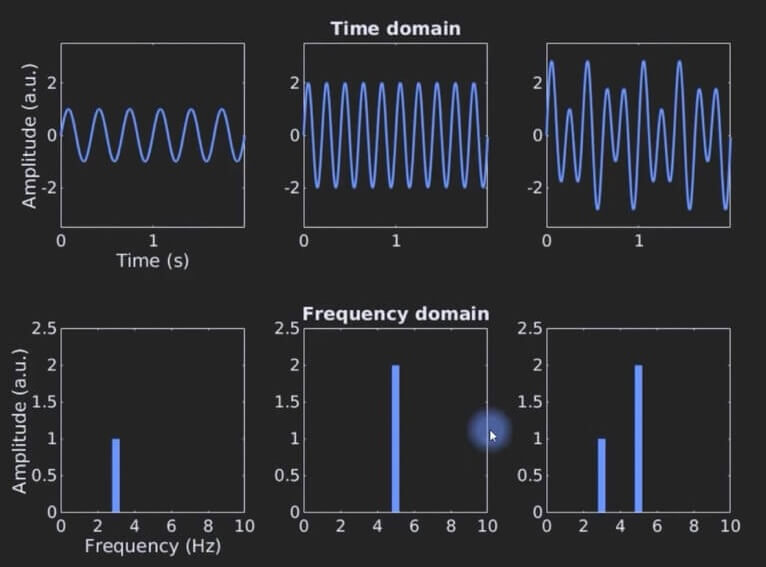
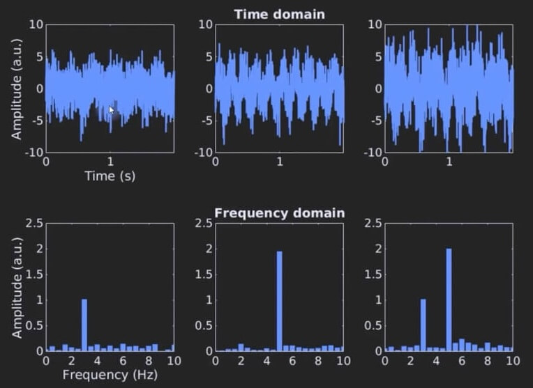
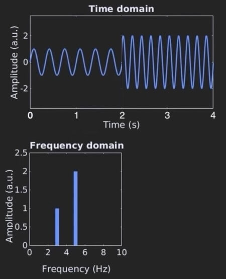

+++
date = '2025-08-21T00:00:00-05:00'
draft = false
title = "Shazam Theory #1 - FT DTFT DFT FFT STFT"
+++

In this article, we will take a look at some of the most common signal-processing terms.

# Fourier Transform (FT)

The **Fourier Transform (FT)** takes a continuous time signal as input and outputs a 
continuous frequency spectrum.

Let's go through some examples:

Example #1

- top-left is a 3Hz sine wave
- bottom-left is the FT of a 3Hz sine wave

Example #2

- top-middle is a 5Hz sine wave
- bottom-middle is the FT of a 5Hz sine wave

Example #3

- top-right is a combination of a 3Hz sine wave and a 5Hz sine wave
- bottom-right is its FT

FT is especially helpful when noise is present. The examples below are the exact same 
as above but with noise added. As you can see, it is hard to interpret the signal in 
the time-domain, but it is easier to interpret the frequency-domain.

# FT, DTFT, DFT, vs FFT

From time-domain to frequency-domain:

|                                            |                                        |
|--------------------------------------------|----------------------------------------|
| **Fourier Transform (FT)**                 | continuous time → continuous frequency |
| **Discrete-Time Fourier Transform (DTFT)** | discrete time → continuous frequency   |
| **Discrete Fourier Transform (DFT)**       | discrete time → discrete frequency     |

While mathematically powerful, the FT & DTFT is not directly computable on a computer because
of its continuous nature and infinite summation. Thus, DFT is used to approximate the FT & DTFT.

Direct computation of DFT is $O(N^2)$. However, by exploiting the symmetries and redundancies of
its calculation, it can be reduced down to $O(N*log N)$. There are many algorithms that do this,
and all of them fall under the umbrella term **Fast Fourier Transform (FFT)**.

Algorithms of FFT:
- Cooley-Tukey FFT - the most common one
- Prime Factor FFT
- Rader's FFT

So when someone says, "take the FT of X" they usually mean "take the FFT of X".

# STFT

Suppose we have a time signal of 3Hz sine wave playing for 2 seconds followed by a 2 second 5Hz sine wave.
The FT of this signal will show spikes at 3Hz and 5Hz.

This is fine and dandy - but if we want to know which frequencies are being played over time, we cannot
take the FT of the entire time-domain at once. We need to chop it up into short time frames. 
This is exactly the idea of **Short-Time Fourier Transform (STFT)** where we take multiple FTs on 
overlapping time frames.

Let's see an example STFT.



In the example above, we compute 3 FTs of the original signal.

- the first FT is computed at time-step 1s with a frame-width of 2s
- the second FT is computed at time-step 2s with the same frame-width of 2s
- the third FT is computed at time-step 3s with the same frame-width of 2s

Then we combine all the FTs into a single output diagram as shown above. 
The output of an STFT is called a spectrogram. Here we can know which 
frequencies are being played over time.

Computing STFT introduces two new variables for you to configure with:

- time-step size
- frame-width size

Usually time-step is half the size of frame-width, so you'll end up choosing 1.

The tradeoffs of choosing larger or smaller values:

- larger values - means higher frequency resolution & lower time resolution
- smaller values - means lower frequency resolution & higher time resolution
