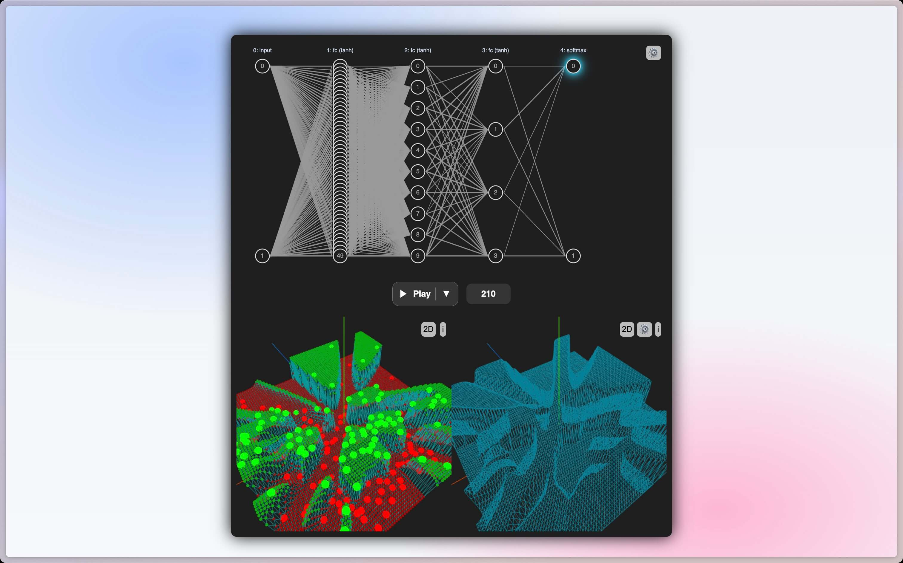

+++
date = '2025-09-01T00:00:00-05:00'
draft = false
title = "Vizualizing Neural Networks (Interactive Tool)"
+++

# Problem

I've always wanted to create an interactive tool to visualize what's happening within a neural network.

# Solution

And so I did:

- [visualizing-neural-networks.marcuschiu.com](https://visualizing-neural-networks.marcuschiu.com)

