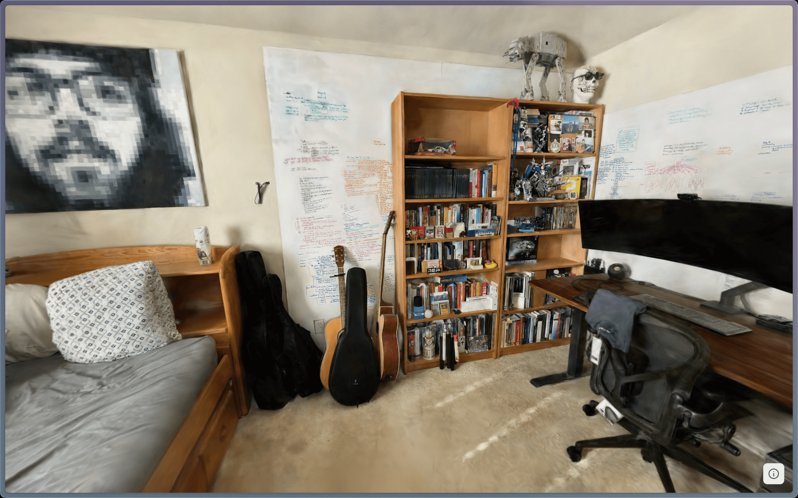

+++
date = '2025-09-18T00:00:00-05:00'
draft = false
title = "I've 3D Scanned my Room (3D Gaussian Splatting)"
+++

# Problem

Sometime ago - I've watched a [video](https://www.youtube.com/watch?v=gXug7Kb3p4I) on `Hidden 3D Inside Google Maps`..

Now I want a 3D model of my room :o

# Solution

And so I did - [my-room.marcuschiu.com](https://my-room.marcuschiu.com)

[](https://my-room.marcuschiu.com)

# How it's Done

code base: https://github.com/TheRealMarcusChiu/3dgs-playcanvas-examples/tree/master

This article shows how to convert a bundle of 2D images into a 3D SOG file.

# 0. Prerequisites

Install `conda` see: https://docs.conda.io/projects/conda/en/stable/user-guide/install/index.html

# 1. Take Pictures of Thing for 3D Reconstruction

https://rd.nytimes.com/projects/gaussian-splatting-guide/

Create a directory `./images` to store all the images.

# 2. Colmap (for Feature Extraction, etc)

Install Colmap

```shell
conda create -n colmap python=3.9 -y
conda activate colmap

pip install torch torchvision torchaudio --index-url https://download.pytorch.org/whl/cu121
conda install -y -c conda-forge colmap
```

Use `colmap` to extract features from `./images`:

```shell
mkdir colmap_output
colmap feature_extractor --database_path colmap_output/database.db --image_path ./images
colmap exhaustive_matcher --database_path colmap_output/database.db
mkdir -p colmap_output/sparse
colmap mapper --database_path colmap_output/database.db --image_path ./images --output_path colmap_output/sparse
mkdir -p colmap_output/dense
colmap image_undistorter \
  --image_path ./images \
  --input_path colmap_output/sparse/0 \
  --output_path colmap_output/dense \
  --output_type COLMAP
mkdir -p colmap_output/dense/sparse/0"
mv colmap_output/dense/sparse/*.bin colmap_output/dense/sparse/0
```

The data in `./colmap_output/dense` will be used in the next tool.

# 3. Gaussian Splatting

Install gaussian splatting tool:

```shell
git clone https://github.com/graphdeco-inria/gaussian-splatting.git
cd gaussian-splatting/
pip install ./submodules/diff-gaussian-rasterization
pip install ./submodules/simple-knn
pip install ./submodules/fused-ssim
conda install -c conda-forge plyfile
pip install opencv-contrib-python
pip install tqdm
```

Use it to train on the colmap output:

```shell
python train.py -s `../colmap_output/dense`
```

Your splat model `point_cloud.ply` will be under the `output` directory

```
output/
└── my_scene/
├── point_cloud.ply   ✅ (this is your splat model)
├── cfg_args          (training config)
├── ckpt_XXXX.pth     (checkpoints)
```

# 4. Edit the PLY file (optional)

- Go to https://superspl.at/editor/, import your splat model, edit, then export.
- or use https://www.realityscan.com/

# 5. Convert PLY into SOG

There are 2 ways to do this:

- https://github.com/playcanvas/splat-transform - newer but fails at [SegFault Bug](https://github.com/playcanvas/splat-transform/issues/49)
- https://github.com/playcanvas/sogs - deprecated but still works as of Sept 2025

# 5a Convert PLY into SOG (`splat-transform` tool)

SKIP THIS if [SegFault Bug](https://github.com/playcanvas/splat-transform/issues/49) is not fixed.

Install nodejs

```shell
curl -o- https://raw.githubusercontent.com/nvm-sh/nvm/v0.39.7/install.sh | bash
source ~/.bashrc
nvm --version
nvm install node
```

Install Splat Transform tool:

```shell
npm install -g @playcanvas/splat-transform
```

Use it to convert PLY to SOG

```shell
# Convert to SOG bundled format
splat-transform input.ply output.sog

# Convert to SOG unbundled format
splat-transform input.ply output/meta.json
```

# 5b Convert PLY into SOG (`sog-compress` tool)

Install `sogs-compress` tool:

```shell
conda create -n sog-compress python=3.9 -y
conda activate sog-compress

pip install torch --index-url https://download.pytorch.org/whl/cu126
pip install cupy-cuda12x
pip install torchpq
pip install git+https://github.com/fraunhoferhhi/PLAS.git
pip install git+https://github.com/playcanvas/sogs.git
```

Use it to compress PLY into Unbundled SOG:

```shell
sogs-compress --ply your_ply_file.ply --output-dir directory_to_store_images_and_metadata
```

# 6. Creating HTML to View SOG

See [HTML templates](https://github.com/TheRealMarcusChiu/3dgs-playcanvas-examples/tree/master/templates)

# Code Base

https://github.com/TheRealMarcusChiu/3dgs-playcanvas-examples/tree/master
