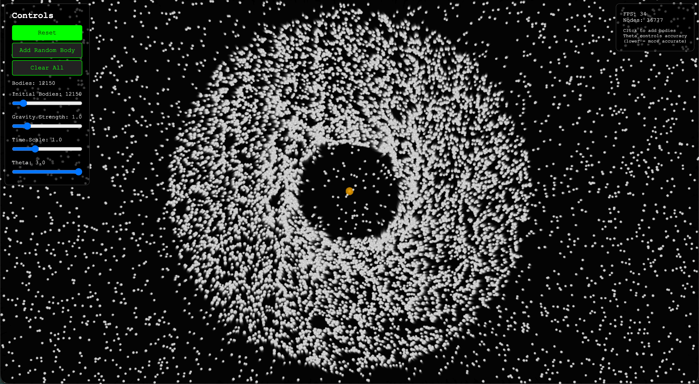

+++
date = '2026-01-26T00:00:00-00:00'
draft = false
title = "Simulating 100,000 Celestial Bodies"
+++

[barnes-hut.marcuschiu.com](https://barnes-hut.marcuschiu.com/)

[](https://barnes-hut.marcuschiu.com)

Simulating gravitational interactions between many bodies can get very slow. If you calculate the force between every pair of bodies, the number of computations grows quadratically as you add more bodies. That’s where the Barnes-Hut algorithm comes in—a clever way to speed things up.

# The Big Idea

Instead of looking at each body individually, the Barnes-Hut algorithm groups nearby bodies together. If a group is far enough away, you can approximate all its bodies as a single body located at the group’s center of mass.

The center of mass is like the average position of the bodies, weighted by their masses. For two bodies with positions `(x1, y1)` and `(x2, y2)` and masses `m1` and `m2`:

```mathematica
Total mass = m1 + m2
Center of mass x = (x1*m1 + x2*m2) / Total mass
Center of mass y = (y1*m1 + y2*m2) / Total mass
```

# Organizing Space with a Quad-Tree

The algorithm uses a [**quad-tree**](https://en.wikipedia.org/wiki/Quadtree), a tree structure where each node has up to 4 children, representing quadrants of 2D space:

- The root node covers the entire space.
- Each child node represents one quadrant of its parent.
- Subdivide until each leaf node contains at most one body.

Leaves represent single bodies, while internal nodes store the center of mass and total mass of all bodies beneath them.

This lets you quickly find which groups of bodies are far enough to approximate as one.

# How to Build the Tree

To insert a new body into the tree:

1. **Empty node:** Place the body here.  
2. **Internal node:** Update its center of mass and total mass, then insert recursively into the correct quadrant.  
3. **External node with a body:** Subdivide the region into four quadrants, and insert both the existing and new bodies recursively.

Repeat until all bodies are in the tree.  

# Calculating Forces

To find the net force on a body:

1. Start at the root.  
2. For each node:
   - If it’s a leaf node (a single body that’s not the target), compute the force directly.  
   - If it’s an internal node, calculate the ratio:
     ```
     s / d
     ```
     - `s` = width of the node’s region  
     - `d` = distance from the body to the node’s center of mass  
   - If `s / d < θ` (a threshold, often 0.5), treat the node as a single body and compute the force.  
   - Otherwise, recurse into the children of the node.

By grouping distant bodies, the algorithm avoids many pairwise calculations, making it much faster than brute force.

# Example Intuition

Imagine calculating forces on body `A`:

1. The root node represents all bodies. If it’s too close, recurse into its children.  
2. Some children are far enough that you can treat groups like `B+C+D` as a single body.  
3. Other nearby bodies, like `E` and `F`, are handled individually.

This way, each body only calculates forces from important neighbors and distant approximations, drastically reducing computation.

# Why It Works

The Barnes-Hut algorithm trades a little accuracy for a huge gain in speed. By adjusting the threshold `θ`, you can balance:

- **Smaller θ:** more accurate but slower (closer to brute force).  
- **Larger θ:** faster but less accurate.

For most simulations, `θ = 0.5` gives excellent results.
