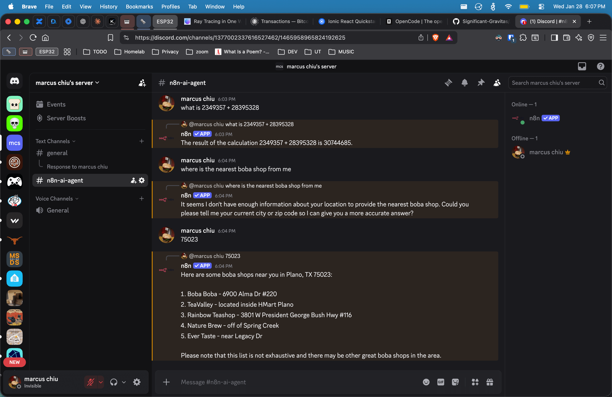
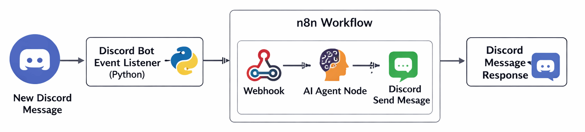
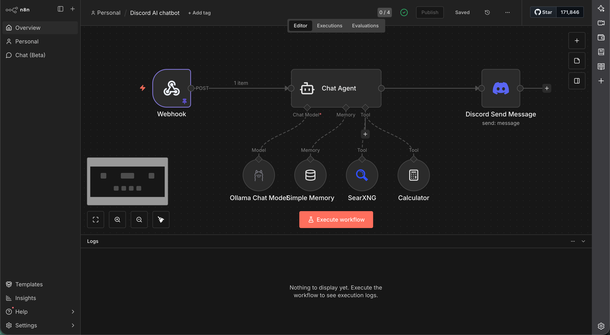

+++
date = '2026-01-28T00:00:00-00:00'
draft = false
title = "Creating a Discord AI Agent with n8n"
+++

[](assets/discord-n8n-ai-chatbot.png)

This guide summarizes an n8n workflow that powers a Discord AI chatbot. The bot listens to messages in selected Discord channels, forwards them to n8n, generates AI replies, and posts responses as threads under the original messages.

# Architecture Flow Diagram

[](assets/architecture-flow.png)

1. On New Discord Message Event
2. Discord Bot Event Listener (Python) - captures messages and sends them to the n8n webhook
3. n8n Workflow
    - Webhook (to receive events from #2)
    - AI Agent Node
    - Discord Send Message Response
4. Discord Receives Message Response

# Prerequisites

* Install n8n - https://docs.n8n.io/hosting/

# 1. Create a Discord Bot

* Create an application in the [Discord Developer Portal](https://discord.com/developers/applications).
* Reset and save the **Bot Token**.
* Enable privileged intents (Presence, Server Members, Message Content).
* Invite the bot to your server with required permissions.

# 2. Deploy the Discord Bot Event Listener (Python)

Clone [https://github.com/TheRealMarcusChiu/discord-ai-chatbot](https://github.com/TheRealMarcusChiu/discord-ai-chatbot)

Install python dependencies (`discord`, `python-dotenv`):

```sh
pip install -r requirements.txt
```

Create `.env` file with:

```ini
WEBHOOK_URL=http://<your-n8n-domain>/webhook/getmessage
TOKEN=<discord-bot-token>
```

In `main.py` configure the bot to listen only to allowed channel IDs:

```python
LISTEN_CHANNELS = [1465958965824192625, 1465958965824192625]  # Replace with your target channel IDs
```

Run the `Discord Bot Event Listener`:

```sh
python main.py
```

# 3. Run Discord Bot Event Listener 24/7

Exit out of `python main.py`.

Copy SystemD `discord-bot.service` file to /etc/systemd/system directory:

```sh
sudo cp discord-bot.service /etc/systemd/system/
```

Reload SystemD and start the Python Bot:

```sh
sudo systemctl daemon-reload
sudo systemctl enable discord-bot.service
sudo systemctl start discord-bot.service
```

Verify:

```sh
sudo systemctl status discord-bot.service
sudo journalctl -u discord-bot.service -f
```

# 3. n8n Workflow

[](assets/discord-ai-chatbot-workflow.png)

You may import this [JSON file](assets/discord-ai-chatbot.json) into your n8n server

* **Webhook** - receives Discord message events
* **Chat Agent** - conversational agent with concise response constraints
* **Language Model** - example uses `ollama`
* **Simple Memory** - rememebers chat history
* **Tools** - ptional tools (extendable with search, lookups, etc.).
* **Discord Response**: Posts AI replies as threads linked to the original message.

Once, configured `SAVE` and `PUBLISH` the workflow!

# 4. Testing

1. Start the Discord bot.
2. Activate the n8n workflow.
3. Send a message in an allowed channel.
4. Confirm the AI reply appears as a thread.

# Result

A reliable, context-aware Discord AI chatbot that runs continuously for seamless user interactions. 🚀
